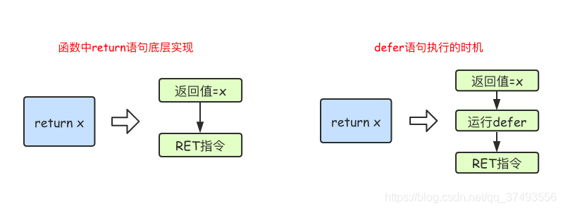

# Go语言函数

------

[TOC]


------

## 1	函数定义

​		**Go语言中定义函数使用`func`关键字，函数的参数和返回值都是可选的,具体格式如下：**

```go
func 函数名(参数列表)(返回值列表) {
    函数体
}
```

- 函数名：由字母、数字、下划线组成。但函数名的第一个字母不能是数字。在同一个包内，函数名也称不能重名（包的概念详见后文）。
- 参数列表：参数由参数变量和参数变量的类型组成，多个参数之间使用,分隔。
- 返回值列表：返回值由返回值变量和其变量类型组成，也可以只写返回值的类型，多个返回值必须用()包裹，并用,分隔。
- 函数体：实现指定功能的代码块。

------

## 2     函数的参数说明

### 2.1	类型简写

​		**函数的参数中如果相邻变量的类型相同，则可以省略类型，例如**

```go
func intSum(x, y int) int {
	return x + y
}
```

上面的代码中，intSum函数有两个参数，这两个参数的类型均为int，因此可以省略x的类型，因为y后面有类型说明，x参数也是该类型。

### 2.2	可变参数

​		**可变参数是指函数的参数数量不固定。Go语言中的可变参数通过在参数名后加`...`来标识。**

​		**注意：可变参数通常要作为函数的最后一个参数。**

```go
func intSum2(x ...int) int {
	fmt.Println(x) //x是一个切片
	sum := 0
	for _, v := range x {
		sum = sum + v
	}
	return sum
}
```

### 2.3	多返回值

​		**Go语言中函数支持多返回值，函数如果有多个返回值时必须用()将所有返回值包裹起来。**

```go
func calc(x, y int) (int, int) {
	sum := x + y
	sub := x - y
	return sum, sub
}
```

### 2.4	返回值命名

​		**函数定义时可以给返回值命名，并在函数体中直接使用这些变量，最后通过`return`关键字返回。**

```go
func calc(x, y int) (sum, sub int) {
	sum = x + y
	sub = x - y
	return
}
```

------

## 3	基本函数举例

```go
package main

import (
	"fmt"
)
func sub(x, y int) int {
	fmt.Printf("sub()求两个参数的差值(%d-%d)=%d\n",x,y,(x-y))
	return x - y
}

func print(){
	fmt.Println("print()没有参数没有返回值的函数……")
}

func sum2(x int32,y int32)  {
	fmt.Println(x+y)
	fmt.Println("sum2()有参数没有返回值的函数")
}

func sum3() (ret int) {
	fmt.Println("sum3() 没有参数有返回值的函数")
	x:=12
	y:=24
	ret=x+y
	return
}
func sum(x int32,y int32) (ret int32){
	fmt.Println("sum()有参数有返回值的函数")
	ret=x+y
	return ret
}

func sum4(x... int)(ret int) {
	fmt.Println("sum4()多个int变量求和的方法")
	for _, v := range x{
		ret = ret + v
	}
	return
}
func main() {
	//函数的调用 ，求两个int类型的差值
	sub(40, 12)
	//调用多个参数求和的函数
	ret := sum4(10, 20)
	fmt.Println(ret)
    slice := make([]int,0)
    slice = append(slice,1,5,6,2)
	ret = sum4(slice)
	ret = sum4(10, 20,30,40)
	fmt.Println(ret)
}
```

```go
package main

import "fmt"

func f1(a [3]int){
	//Go语言中函数的传递的都是值（相当于Ctrl+C Ctrl+V）
	a[1]=100 //这个地方相当于修改的副本数组的值，原来数组的值不变
	fmt.Printf("传入数组a要修改的元素的内存地址是%v\n",&a[1])//0xc0000103a8
}
func main() {
	x:=[3]int{1,2,3}
	fmt.Println(x) //[1 2 3]
	fmt.Printf("x本身数组的内存地址是%v\n",&x[1]) //0xc000010348
	f1(x) //调用函数
	fmt.Println(x) //[1 2 3]
}
```

------

## 4	函数类型与变量

### 4.1	定义函数类型

​		**我们可以使用type关键字来定义一个函数类型，具体格式如下**

```go
type calculation func(int, int) int
// 上面语句定义了一个calculation类型，它是一种函数类型，这种函数接收两个int类型的参数并且返回一个int类型的返回值。

// 凡是满足这个条件的函数都是calculation类型的函数，例如下面的add和sub是calculation类型

func add(x, y int) int {
	return x + y
}

func sub(x, y int) int {
	return x - y
}
var c calculation
c = add
c = sub
c(1, 2)

```

### 4.2	函数类型变量

​		**我们可以声明函数类型的变量并且为该变量赋值**

```go
package main

import (
	"fmt"
)
type calculation func(int, int) int

func add(x,y int) int{
	return x+y
}
func sub(x, y int) int {
	return x - y
}
func main() {
	var c calculation               // 声明一个calculation类型的变量c
	c = add                         // 把add赋值给c
	fmt.Printf("type of c:%T\n", c) // type of c:main.calculation
	fmt.Println(c(5, 2))            // 像调用add(5,2)一样调用c

	f := sub                   		// 将函数sub赋值给变量f1
	fmt.Printf("type of f:%T\n", f) // type of f:func(int, int) int
	fmt.Println(f(10, 20))          // 像调用sub(10,20)一样调用f
}
// 一个方法就是一个包含了接收者的函数。接收者可以是命名类型或者结构体类型的一个值或者是一个指针。所有给定类型的方法属于该类型的方法集。
```

------

## 5	高阶函数

​		高阶函数分为函数作为参数和函数作为返回值两部分。

### 5.1	函数作为参数

```go
func add(x, y int) int {
	return x + y
}
func calc(x, y int, op func(int, int) int) int {
	return op(x, y)
}
func main() {
	ret2 := calc(10, 20, add)
	fmt.Println(ret2) //30
}
```

### 5.2 	函数作为返回值

```go
func do(s string) (func(int, int) int, error) {
	switch s {
	case "+":
		return add, nil
	case "-":
		return sub, nil
	default:
		err := errors.New("无法识别的操作符")
		return nil, err
	}
}
```

### 5.3 	递归函数

```go
//用递归实现阶乘计算
func factorial(n int) (result int){
   	if(n == 0){
   		return 1
   	}
  	result =n * factorial(n-1)
   	return
}

//用for循环实现阶乘计算
func getMultiple(num int) (result int){
     	result = 1
   	for i := 1; i <= num; i++ {
      	result *=  i
   	}
   	return
}
```

------

## 6 	匿名函数和闭包

### 6.1	 匿名函数

​		函数当然还可以作为返回值，但是在Go语言中函数内部不能再像之前那样定义函数了，只能定义匿名函数。匿名函数就是没有函数名的函数，匿名函数多用于实现回调函数和闭包。
​		匿名函数的定义格式如下：

```go
func(参数)(返回值){
    函数体
}
// 匿名函数因为没有函数名，所以没办法像普通函数那样调用，所以匿名函数需要保存到某个变量或者作为立即执行函数:

```

```go
func main() {
	// 将匿名函数保存到变量
	add := func(x, y int) {
		fmt.Println(x + y)
	}
	add(10, 20) // 通过变量调用匿名函数

	//自执行函数：匿名函数定义完加()直接执行
	func(x, y int) {
		fmt.Println(x + y)
	}(10, 20)
}
```

### 6.2	 闭包

​		**所谓闭包就是一个函数 “捕获” 了和它在同一作用域的其它常量和变量。这就意味着闭包被调用的时候，不管程序在什么地方调用，闭包能够使用这些常量和变量。它不关心这些捕获了的变量和常量是否超出了其作用域，所以只要闭包还在使用它，这些变量就还会存在。**

​		Go 语言支持匿名函数，可作为闭包。匿名函数是一个"内联"语句或表达式。匿名函数的优越性在于可以直接使用函数内的变量，不必申明。

以下实例中，我们创建了函数 getSequence() ，返回另外一个函数。该函数的目的是在闭包中递增 i 变量，代码如下：

```go
package main

import "fmt"

func getSequence() func() int {
   i:=0
   return func() int {
      i++
     return i  
   }
}

func main(){
   /* nextNumber 为一个函数，函数 i 为 0 */
   nextNumber := getSequence()  

   /* 调用 nextNumber 函数，i 变量自增 1 并返回 */
   fmt.Println(nextNumber())
   fmt.Println(nextNumber())
   fmt.Println(nextNumber())
   
   /* 创建新的函数 nextNumber1，并查看结果 */
   nextNumber1 := getSequence()  
   fmt.Println(nextNumber1())
   fmt.Println(nextNumber1())
}
```

输出结果

```
1
2
3
1
2
```

------

## 7 	defer语句

​		Go语言中的defer语句会将其后面跟随的语句进行延迟处理。在defer归属的函数即将返回时，将延迟处理的语句按defer定义的逆序进行执行，也就是说，先被defer的语句最后被执行，最后被defer的语句，最先被执行。

**defer延迟调用：**

- 1、确保调用在函数结束时发生；
- 2、defer列表为先进后出；
- 3、通常在Open/Close Lock/Unlock中使用。

**defer的应用场景**

- 事务的提交或回滚
- 用于锁的关闭，连接的延迟关闭等，通常在函数的结束时调用
- 资源清理、文件关闭、数据库连接关闭、解锁及记录时间等
- 另外defer确实有一定的开销，拒绝滥用

```go
func main() {
	fmt.Println("start") 
	defer fmt.Println(1)
	defer fmt.Println(2)
	defer fmt.Println(3)
	fmt.Println("end")
}
```

输出

```go
start
end
3
2
1
```

### 7.1 	defer执行时机

​		在Go语言的函数中return语句在底层并不是原子操作，它分为给返回值赋值和RET指令两步。而defer语句执行的时机就在返回值赋值操作后，RET指令执行前。具体如下图所示



### 7.2 	defer经典案例

**注意**：

- go语言中函数的 return不是原子操作,在底层是分为两步来执行
- 第一步:返回值赋值
- 第二步:真正的RET返回
- 函数中如果存在 defer,那么 defer执行的时机是在第一歩和第二步之间

```go
//1 返回值赋值  返回值=x=5
// 2 执行defer 修改x的值而不是返回值的值
// 3 真正的返回
func f1() int {
	x := 5
	defer func() {
		x++
	}()
	return x
}

//1 返回值赋值  返回值为x 此时x=5
// 2 执行defer 修改x的值 此时x=6
// 3 真正的返回x 所以结果为6
func f2() (x int) {
	defer func() {
		x++
	}()
	return 5
}

//1 返回值赋值  返回值为y   此时y=x=5
// 2 执行defer 修改x的值 此时x=6,y的值没有改变
// 3 真正的返回y 所以结果为5
func f3() (y int) {
	x := 5
	defer func() {
		x++
	}()
	return x
}

//1 返回值赋值  返回值为x   此时x=5
// 2 执行defer 修改局部变量x的值，而不是返回值x的值
// 3 真正的返回  所以结果为5
func f4() (x int) {
	defer func(x int) {
		x++
	}(x)
	return 5
}
func main() {
	fmt.Println(f1())   //5
	fmt.Println(f2())   //6
	fmt.Println(f3())   //5
	fmt.Println(f4())   //5
}
```

输出结果

```
5
6
5
5
```


------

## 8	 内置函数介绍

| 内置函数       | 介绍                                                         |
| -------------- | ------------------------------------------------------------ |
| close          | 主要用来关闭channel                                          |
| len            | 用来求长度，比如string、array、slice、map、channel           |
| new            | 用来分配内存，主要用来分配值类型，比如int、struct。返回的是指针 |
| make           | 用来分配内存，主要用来分配引用类型，比如chan、map、slice     |
| append         | 用来追加元素到数组、slice中                                  |
| panic和recover | 用来做错误处理 类似于java语言中的try-catch-finally           |

### 8.1	 panic/recover

**panic**

- 1、panic用于主动抛出错误,panic可以在任何地方引发，panic能够改变程序的控制流，当一个函数调用执行panic时，它会立刻停止执行函数中其他的代码，然后马上运行其中的defer函数，执行成功后会返回给调用方
- 2、假如函数F中书写了panic语句，会终止其后要执行的代码，在panic所在函数F内如果存在要执行的defer函数列表，按照defer的逆序执行
- 3、返回函数function1的调用者function2，在function2中，调用函数function1语句之后的代码不会执行，假如函数function1中存在要执行的defer函数列表，按照defer的逆序执行
- 4、直到goroutine整个退出，并报告错误


**recever**

- 1、recover 用来捕获panic 抛出的错误。但recover只有在defer调用的函数中有效。
- 2、用来控制一个goroutine的panicking行为，捕获panic，从而影响应用的行为
- 3、在defer函数中,通过recever来终止一个goroutine的panicking过程,从而恢复正常代码的执行
- 4、可以获取通过panic传递的error

简单来讲：go中可以抛出一个panic的异常，然后在defer中通过recover捕获这个异常，然后正常处理。

### 8.2 	示例代码一

**main函数相当于调用者G，f函数相当于函数F**

```go
func main() {
	fmt.Println("c")
   	defer func() { // 必须要先声明defer，否则不能捕获到panic异常
      	fmt.Println("d")
      	if err := recover(); err != nil {
            fmt.Println(err) // 这里的err其实就是panic传入的内容
      	}
      	fmt.Println("e")
   	}()
   	f() //开始调用f
   	fmt.Println("f") //这里开始下面代码不会再执行
}

func f() {
   	fmt.Println("a")
   	panic("异常信息")
   	fmt.Println("b") //这里开始下面代码不会再执行
}

```


```
-------output-------
c
a
d
异常信息
e
```

### 8.3 	示例代码二

```go
func funcA() {
	fmt.Println("func A")
}

func funcB() {
	panic("panic in B")
}

func funcC() {
	fmt.Println("func C")
}
func main() {
	funcA()
	funcB()
	funcC()
}
```

```
-----------------输出结果如下------------------------
func A
panic: panic in B

goroutine 1 [running]:
main.funcB(...)
        .../code/func/main.go:12
main.main()
        .../code/func/main.go:20 +0x98
```

​		程序运行期间funcB中引发了panic导致程序崩溃，异常退出了。这个时候我们就可以通过recover将程序恢复回来，使其能够继续往后执行。

```go
func funcA() {
	fmt.Println("func A")
}

func funcB() {
	defer func() {
		err := recover()
		//如果程序出出现了panic错误,可以通过recover恢复过来
		if err != nil {
			fmt.Println("recover in B")
		}
	}()
	panic("panic in B")
}

func funcC() {
	fmt.Println("func C")
}
func main() {
	funcA()
	funcB()
	funcC()
}
```

### 8.4 	recover/panic注意点

- 利用recover处理panic指令，defer必须在panic之前声明，否则当panic时，recover无法捕获到panic．

- recover()必须搭配defer使用。

- defer一定要在可能引发panic的语句之前定义。

  

------


[^参考]: [Go语言函数](https://www.cnblogs.com/ourlang/p/12230951.html)